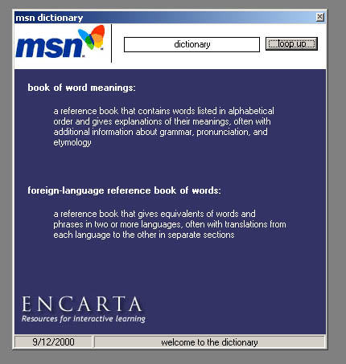



## COMPLETE DICTIONARY

### Description

this code is an example for anyone interested in making a dictionary or any sort of internet file, it goes to dictionary.msn.com and takes the definitions and returns them to the program, a great program!
 
### More Info
 
one textbox for the word

the definition of the word

             |
---                |---
**Submitted On**   |2000-09-12 21:52:48
**By**             |[matt venables](https://github.com/Planet-Source-Code/PSCIndex/blob/master/ByAuthor/matt-venables.md)
**Level**          |Intermediate
**User Rating**    |4.0 (24 globes from 6 users)
**Compatibility**  |VB 5\.0, VB 6\.0
**Category**       |[Internet/ HTML](https://github.com/Planet-Source-Code/PSCIndex/blob/master/ByCategory/internet-html__1-34.md)
**World**          |[Visual Basic](https://github.com/Planet-Source-Code/PSCIndex/blob/master/ByWorld/visual-basic.md)
**Archive File**   |[CODE\_UPLOAD98529122000\.zip](https://github.com/Planet-Source-Code/matt-venables-complete-dictionary__1-11440/archive/master.zip)

